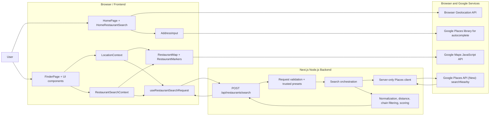
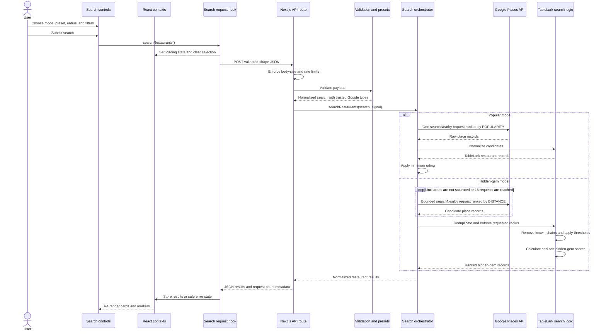

# TableLark Architecture

This document describes the current TableLark implementation and the responsibility boundaries between the browser frontend, the Next.js backend, browser platform APIs, and Google Maps Platform.

## System overview

TableLark is a Next.js App Router application with two user-facing routes and one server API route:

| Route | Runtime | Purpose |
| --- | --- | --- |
| `/` | Next.js page plus client components | Homepage, browser geolocation entry point, and address autocomplete entry point. |
| `/finder` | Next.js page plus client components | Interactive map, location controls, search filters, results, and restaurant selection. |
| `/api/restaurants/search` | Next.js Node.js server route | Validates search requests, protects the private API key, queries Google Places, and applies TableLark search logic. |

The browser talks directly to Google Maps Platform for map rendering and address autocomplete. Restaurant discovery follows a separate path through TableLark's server so the private Places API key and search rules never need to be exposed to the browser.

## Responsibility boundaries

| Area | Browser frontend | TableLark backend | Google / browser platform |
| --- | --- | --- | --- |
| Page rendering | Composes the homepage, Finder, responsive panels, forms, result cards, loading states, and errors. | Renders the initial Next.js route structure and metadata. | Google Maps JavaScript API renders the interactive base map. |
| Location selection | Opens location controls, handles selected coordinates, and routes homepage selections to `/finder?lat=...&lng=...`. | Validates optional Finder query coordinates before using them as initial state. | The browser Geolocation API supplies device coordinates after permission. Google Places supplies address suggestions and converts a selected prediction into coordinates. |
| Search state | Holds the selected location, radius, search mode, preset, filters, results, loading state, errors, and selected restaurant in React context. | Does not persist user search state between navigations or sessions. | No Google service owns TableLark's React state. |
| Search request | Builds JSON, sends `POST /api/restaurants/search`, aborts stale requests, and displays the response. | Limits request size and rate, parses JSON, validates every field, and maps errors to safe HTTP responses. | Google receives only validated server requests. |
| Category selection | Displays TableLark's named presets. | Resolves the preset ID to a trusted list of Google place types; client-provided type arrays are not trusted. | Places API filters results using the supplied included types or primary types. |
| Popular search | Displays the mode and minimum-rating controls. | Makes one Places request ranked by popularity and removes results below the requested rating. | Places API performs the nearby lookup and its `POPULARITY` ranking. |
| Hidden-gem search | Displays rating and review-count controls and renders the returned ranking. | Subdivides saturated areas, gathers results, removes known chains, removes duplicates and out-of-radius places, applies thresholds, calculates hidden-gem scores, and sorts the results. | Places API returns candidate places ranked by distance for each bounded request. Google does not decide what qualifies as a hidden gem. |
| Restaurant data | Formats ratings, price levels, addresses, attribution links, and Google Maps links. | Requests a field mask and normalizes Google's response into TableLark's restaurant model. | Places API supplies place IDs, names, addresses, coordinates, ratings, review counts, price levels, types, icon URIs, Google Maps URIs, and required attributions. |
| Map interaction | Renders TableLark pins, pans to the search center or selected restaurant, changes zoom, and opens an information window. | No map rendering responsibility. | Maps JavaScript API supplies map tiles, camera behavior, advanced-marker primitives, and info-window primitives. |

## Architecture component diagram



## Restaurant-search sequence diagram

This UML sequence diagram shows the complete restaurant-search request. Address autocomplete is intentionally absent because it is a direct browser-to-Google interaction and does not use this server route.



## Location flow

TableLark has three sources of Finder coordinates, in this order:

1. Valid `lat` and `lng` query parameters supplied to `/finder`.
2. The `LocationContext` default: New Orleans at `29.9511, -90.0715`.
3. A later user selection made from the Finder's current-location or address controls.

The homepage can create the first source in two ways:

- **Current location:** `navigator.geolocation.getCurrentPosition` asks the browser for permission and routes to `/finder` with the returned coordinates.
- **Address:** the Google Places JavaScript library returns autocomplete predictions. When the user selects one, the frontend fetches only `formattedAddress` and `location`, then routes to `/finder` with the coordinates.

The Finder uses the same `AddressInput` component, but a selected prediction updates `LocationContext` instead of navigating. Changing latitude or longitude clears existing restaurant results. Location state is currently memory-only and is not stored in cookies, `localStorage`, a database, or a user account.

`LatAndLngInput.jsx` exists in the source tree but is not mounted by the current UI.

## Frontend architecture

### Page and provider composition

- `src/app/page.jsx` renders the homepage and its two Finder entry actions.
- `src/app/finder/page.jsx` parses optional query coordinates and composes the map, top action bar, and discovery panel.
- `src/app/providers.jsx` installs the public Google `APIProvider`, `LocationProvider`, and `RestaurantSearchProvider` around the Finder.
- `src/app/finder/layout.jsx` loads Finder-only styles.

### Client state

`LocationContext` owns:

```text
lat, lng, radiusMeters
```

`RestaurantSearchContext` owns:

```text
searchMode, cuisinePresetId, minRating, minReviews, maxReviews
restaurants, selectedRestaurantId, isLoading, errorMessage, hasSearched
```

Derived values such as `searchFilters` and `selectedRestaurant` are memoized. Actions centralize the transitions for beginning, completing, failing, clearing, and selecting within a search.

### Request management

`useRestaurantSearchRequest` is the boundary between React state and the server API. It:

- serializes the active location and search filters;
- aborts the previous request before starting another;
- aborts in-flight work when the component unmounts;
- clears stale results when the search coordinates change;
- converts non-success responses into user-visible errors; and
- ignores responses from requests that are no longer active.

### Map and result synchronization

Cards and markers use the same `selectedRestaurantId` in context. Selecting a card or marker updates that shared state. `MapPositionController` pans to the search location when it changes and pans and zooms to a selected restaurant. The frontend, not Google Places, decides the pin colors, selected state, panel layout, and displayed formatting.

## Backend architecture

### API boundary

`POST /api/restaurants/search` runs in the Node.js runtime. Before searching it:

- rejects bodies larger than 10,000 bytes using both the header and the encoded body;
- applies an in-memory limit of 12 requests per 60 seconds per forwarded IP, real IP, or the `local` fallback;
- parses JSON and returns a safe `400` error for malformed input;
- validates modes, coordinates, radius, preset IDs, filter ranges, and the maximum result count; and
- resolves preset IDs on the server to prevent callers from injecting arbitrary Google place types.

The in-memory rate limiter is process-local. It resets on restart and does not coordinate limits across multiple server instances, so a shared production rate limiter would be needed for strong distributed enforcement.

### Google Places client

`places-client.js` is guarded by `server-only` and reads `GOOGLE_PLACES_API_KEY`. It calls:

```text
POST https://places.googleapis.com/v1/places:searchNearby
```

Each request uses a 15-second timeout, `cache: "no-store"`, U.S. region and English language hints, a maximum 50,000-meter circle, and a restricted field mask. Google failures are logged on the server, while the browser receives a safer public error message.

### Popular mode

Popular mode makes one Google request using `rankPreference: "POPULARITY"`. Google supplies the candidate order. TableLark then removes candidates below the selected minimum rating. Review-count inputs are ignored for this mode.

### Hidden-gem mode

Hidden-gem mode uses TableLark-specific logic:

1. Search the requested circle using Google's distance ranking.
2. Treat a response containing the per-request maximum as potentially saturated.
3. Subdivide saturated coverage into four child areas and continue recursively.
4. Stop when an area is no longer saturated, its effective radius reaches approximately half a mile, the request is aborted, or 16 Google requests have been made.
5. Deduplicate candidates by Google place ID and remove candidates outside the originally requested radius.
6. Remove restaurants matching the curated chain alias list.
7. Require the chosen rating and review-count ranges.
8. Calculate a weighted score: 65% rating quality, 10% review confidence, and 25% obscurity based on logarithmic review count.
9. Sort by hidden-gem score, then rating.

`maxResults` is capped at 20 per Google request. Hidden-gem mode can aggregate candidates from several requests before filtering and ranking.

## API contract

### Request

```json
{
  "mode": "popular",
  "center": {
    "lat": 29.9511,
    "lng": -90.0715
  },
  "radiusMeters": 8047,
  "filters": {
    "presetId": "all",
    "minRating": 4,
    "minReviews": 10,
    "maxReviews": 300,
    "maxResults": 20
  }
}
```

Only hidden-gem mode uses `minReviews` and `maxReviews` after validation.

### Success response

```json
{
  "restaurants": [
    {
      "id": "google-place-id",
      "name": "Example Restaurant",
      "address": "123 Example Street",
      "location": { "lat": 29.95, "lng": -90.07 },
      "rating": 4.7,
      "reviewCount": 84,
      "priceLevel": "MODERATE",
      "primaryType": "restaurant",
      "primaryTypeDisplayName": "Restaurant",
      "iconMaskBaseURI": "https://maps.gstatic.com/...",
      "googleMapsURI": "https://maps.google.com/...",
      "attributions": []
    }
  ],
  "meta": {
    "resultCount": 1,
    "googleRequestCount": 1
  }
}
```

Hidden-gem results also contain a numeric `hiddenGemScore`. Missing optional Google fields are normalized to `null`, an empty string, or an empty array as appropriate.

### Error behavior

| Status | Meaning |
| --- | --- |
| `400` | Malformed JSON or invalid search input. |
| `413` | Request body exceeds 10,000 bytes. |
| `429` | Process-local search rate limit exceeded. |
| `499` | The browser disconnected or aborted the request during server work. |
| `500` | Unexpected TableLark server failure. |
| `502` | Google rejected or failed the request, or the server could not reach Google. |
| `503` | The private server Places key is not configured. |
| `504` | Google Places exceeded the server timeout. |

## Google Maps Platform boundary

### Google handles

- map tiles and interactive map behavior;
- address autocomplete predictions and session tokens;
- fetching the selected address's formatted address and coordinates;
- nearby place discovery within a supplied circle;
- popularity or distance ranking for an individual Places request;
- place identity and the requested place fields; and
- Google Maps links, icon assets, and attribution data when returned.

### TableLark handles

- the meaning of Popular and Hidden Gems in the product;
- which category presets are available;
- server-side trust and validation of preset types;
- hidden-gem area subdivision and request limits;
- chain identification and exclusion;
- distance enforcement and deduplication;
- minimum-rating and review-count filters;
- the hidden-gem scoring formula and final ordering;
- UI state, card and marker selection, responsive layout, and error presentation; and
- protection of the private server API key.

Google ratings and review counts are inputs to TableLark's algorithm. They are not endorsements or hidden-gem classifications produced by Google.

## Configuration and security

| Variable | Exposed to browser? | Used for |
| --- | --- | --- |
| `NEXT_PUBLIC_GOOGLE_MAPS_API_KEY` | Yes | Maps JavaScript API and browser-side Places autocomplete. |
| `NEXT_PUBLIC_GOOGLE_MAP_ID` | Yes | Google advanced-marker-enabled map configuration. |
| `GOOGLE_PLACES_API_KEY` | No | Server-to-server Places API (New) restaurant searches. |

Public browser values are expected to be visible and must be restricted to authorized web origins and browser APIs. The private key must be restricted to Places API (New) and kept only in the server environment.

Precise coordinates may appear in Finder URLs and restaurant-search request bodies. The application does not currently persist those coordinates, but normal browser history, server access logs, and infrastructure logs should still be considered when defining a production privacy policy.

## Source map

```text
src/app/                         Next.js pages, layouts, providers, and API route
src/components/                  Homepage, location, map, search, and result UI
src/context/                     Browser-side location and restaurant-search state
src/hooks/                       Browser-to-server request lifecycle
src/lib/restaurants/             Server validation, Google client, presets, and algorithms
src/styles/                      Theme variables and route/component styles
test/restaurants/                Unit tests for presets, validation, and search logic
```

## Validation coverage

The current Node test suite covers:

- Google place normalization;
- geographic distance and radius enforcement;
- deduplication;
- hidden-gem filtering, scoring order, and chain removal;
- conservative chain matching;
- built-in preset integrity;
- request validation and trusted preset resolution; and
- invalid mode, coordinates, preset, and review-range rejection.

Map rendering, Google autocomplete, browser geolocation, responsive interaction, and live Places responses require manual or browser-driven integration testing because they depend on external services and browser permissions.
